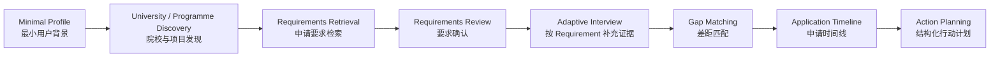
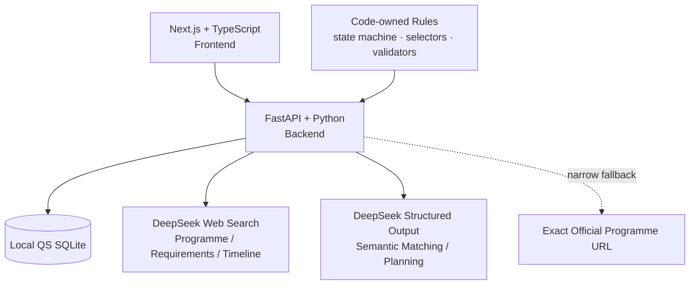
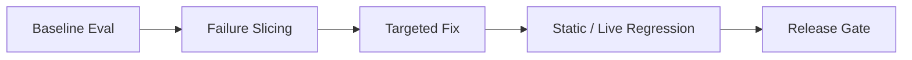

# UniversityApplyPlan（知途留学）

> AI-powered study-abroad planning agent that turns a student's background and target programme requirements into a structured gap analysis and actionable application plan.

这是一个面向中国留学生的留学申请规划 MVP。它把院校与项目发现、申请要求检索、背景补充、差距判断、申请时间线和行动规划组织成一条可验证的结构化工作流，而不是一次性的通用 LLM 问答。

## 它解决什么问题

准备研究生申请时，用户通常需要同时回答四类问题：

- 目标项目到底要求什么，哪些是硬性资格，哪些是申请材料？
- 信息分散在项目页、Admissions、How to apply、Supporting documents 等不同页面，而且会随申请周期变化。
- 自己的学历、课程、语言、经历和材料与要求之间还差什么？
- 在 Deadline 明确或尚未公布的情况下，语言考试、文书、推荐信和其他材料应如何安排？

本项目将这些问题拆成有 schema、有状态、有来源和有校验规则的步骤，让 Retrieval、Gap Analysis 与 Planning 共享同一组 Requirement 关联。

## Product Workflow



用户可先提供或跳过最小背景，再选择目标院校与项目。系统从 Requirements 出发，只追问完成判断所缺少的信息；证据进入终态后生成 Gap Table，并结合目标申请周期的 Timeline 输出统一的阶段式 Action Plan。

## Core Features

- **QS-based University Discovery**：使用本地 QS SQLite 数据按国家、综合/学科排名范围筛选候选院校；MVP 排名体系固定为 QS。
- **Target Programme Discovery**：在用户选择院校后发现相关硕士项目，并确认目标项目与官方项目 URL。
- **Official-source-first Requirements Retrieval**：优先围绕 exact programme URL 搜索 Entry requirements、Admissions、How to apply、Supporting documents 等 section，输出结构化 Requirement、来源层级和 provenance。
- **Narrow Official URL Fallback**：Search 主路径无法形成有效 Requirements 时，仅对已知 `official_program_url` 做一次安全 direct fetch，再进行 Requirements extraction；不扩展成多页面 crawler。
- **Requirements Review**：按 academic、course、language、materials 等类别展示 Requirement，并保留 importance、source URL 与周期适用性。
- **Requirement-driven Adaptive Interview**：复用 Profile 和本次流程中已回答的 evidence，只追问真正 `missing` 的 slot；区分 `known`、`known_negative`、`unknown`，支持多字段回答、compound materials 和 OR alternatives。
- **Gap Analysis**：对明确数值/材料状态使用代码规则，对课程、专业或经历相关性等语义问题进行批量判断，输出 `met / partial / not_met / unknown`。
- **Admission-cycle-aware Applicability**：将“来源是否官方”与“是否适用于目标申请周期”分开表达；上一周期或适用性未知的信息不会直接形成硬性 `not_met`。
- **Official Application Timeline**：检索目标项目、目标入学年份和学期对应的官方开放时间与 Deadline；未找到时保持 `not_found`，不补造精确日期。
- **Action Planning**：代码先根据 Gap 状态确定 action kind，模型负责 milestone 内容、依赖、并行关系和阶段安排；required Gap 由 Validator 检查是否遗漏。

## AI / System Architecture



| 层级 | 当前职责 |
| --- | --- |
| Frontend | Next.js 16、React、TypeScript；承载筛选、Review、Adaptive Interview、Gap Table 与统一 Timeline UI。 |
| Backend | FastAPI、Python；承载 schema、流程编排、QS 查询、evidence 状态、Gap 规则、temporal gate 和 Plan Validator。 |
| AI | DeepSeek API、DeepSeek Web Search、structured output；处理动态搜索、信息提取、有限语义判断与计划内容编排。 |
| Data | 本地只读 QS SQLite 与学科映射数据。 |

系统刻意区分两类职责：

- **代码负责确定性约束**：QS 本地筛选、evidence terminal state、OR group 收敛、temporal gate、Action Selector、Deadline/no-fabrication 和 schema validation。
- **LLM 负责动态任务**：项目与官网信息搜索、Requirements 提取、语义等价判断、Timeline Retrieval，以及 Action 内容、依赖和阶段安排。

## Reliability / Evaluation

项目不仅依赖手工 Demo，而是保留了一套 MVP Eval Dataset、固定 user fixture、Behavioral/Edge cases、Regression cases 与人工审核 rubric。迭代方式是：



代表性 failure classes 与当前防线：

| Priority | Failure class | 对应修复与约束 |
| --- | --- | --- |
| P0 | **Section-level Recall / Empty Requirements**：已知项目页但只召回 Overview，或最终为空。 | 请求配置最多两次 Web Search 的 section search contract；优先 exact programme URL；满足窄触发条件时使用 official URL direct-fetch fallback。 |
| P1 | **Important Requirement Omission**：已返回多项要求，但漏掉 transcript、programme-specific sheet 等 required material。 | required-first extraction；mandatory supporting-document inventory；required/conditional-required 不受低优先级条目预算挤压。 |
| P2 | **Temporal Applicability / Freshness**：官方事实真实，但属于上一周期或目标周期尚未公布。 | provenance 与 temporal applicability 正交；`previous_cycle / not_yet_published / unknown` 在正式 Gap Matching 前进入 temporal gate。 |

其他重点 regression 包括：

- Adaptive Interview 收敛：多字段回答、缺失 subscore、明确否定/不知道、Profile evidence 复用和 OR alternatives。
- Planning contract：`action_kind` 由代码 Action Selector 决定，模型不能覆盖；required Gap omission 由 Validator 拒绝。
- Timeline no-fabrication：模糊 Deadline 不转换成伪精确日期，`not_found` 只生成阶段计划。
- Manual Review：按是否影响资格判断、Gap 或 Planning 区分 Critical、Major、Minor，而不是要求逐字复刻官网。

评测资料：

- [MVP Eval Dataset](docs/evals/mvp_eval_dataset.md)
- [MVP Baseline Eval Report](docs/evals/mvp_eval_report.md)
- [Manual Review Adjudication](docs/evals/mvp_manual_review_results.md)
- [Regression Cases](docs/evals/regression_cases.md)

> Baseline Report 和 Manual Review 文件保留当时的历史结果，用于说明 failure slicing 与修复来源；它们不应被解读为对当前代码的最新全量重跑结论。动态官网事实仍需要按对应申请周期人工核对。

## Quick Start

### Requirements

- Python 3.8+
- Node.js 20.9+
- 一个由你自己提供的 DeepSeek API Key

### First-time setup

以下示例使用 Windows PowerShell：

```powershell
git clone <repository-url>
cd UniversityApplyPlan

# Backend
cd backend
python -m venv .venv
.\.venv\Scripts\Activate.ps1
python -m pip install -r requirements.txt
Copy-Item .env.example .env

# 在 backend/.env 中填写自己的 DeepSeek API Key
# DEEPSEEK_API_KEY=your_key

# Frontend
cd ..\frontend
npm install
cd ..
```

### One-command startup

完成首次安装后，在项目根目录执行：

```powershell
python dev.py
```

- Frontend: [http://localhost:3000](http://localhost:3000)
- Backend: [http://127.0.0.1:8000](http://127.0.0.1:8000)
- API Docs: [http://127.0.0.1:8000/docs](http://127.0.0.1:8000/docs)

按 `Ctrl+C` 可同时停止本次启动的 frontend 与 backend 进程。

<details>
<summary>分别启动 frontend / backend</summary>

Backend：

```powershell
cd backend
.\.venv\Scripts\Activate.ps1
python -m uvicorn app.main:app --reload --host 127.0.0.1 --port 8000
```

Frontend（另一个终端）：

```powershell
cd frontend
npm run dev -- --hostname localhost --port 3000
```

</details>

## BYOK / Cost Model

本项目采用 BYOK（Bring Your Own Key）：

- 开源用户在 `backend/.env` 中配置自己的 `DEEPSEEK_API_KEY`。
- API credential 仅由 FastAPI backend 读取，不会配置为 `NEXT_PUBLIC_*`，也不会发送给 frontend。
- `.env` 及其本地/生产变体被 Git ignore；仓库只保留 placeholder `.env.example`。
- DeepSeek API 调用产生的费用由 Key 持有者承担，实际消耗取决于搜索次数、输出长度和使用频率。

仓库当前不提供托管 API Key 或公共 Hosted Demo。

## Project Structure

```text
UniversityApplyPlan/
├── frontend/              # Next.js UI 与产品工作流
├── backend/               # FastAPI、AI orchestration、QS data 与 regression scripts
├── docs/evals/            # Dataset、Baseline、Manual Review 与 regression records
├── dev.py                 # 根目录双服务启动器
└── README.md
```

## Known Limitations

- 当前只支持 DeepSeek，不包含运行时 provider 切换或多模型 fallback。
- Live Web Search 会带来几十秒级延迟和一定随机性；复杂项目的 Requirements Retrieval 尤其明显。
- `official_verified` 是内部 provenance enum，表示模型将该条目归因于官方来源；它不等同于 backend 独立 verifier 对事实进行了再次验证。
- 招生要求和时间线会动态变化。涉及资格、材料和 Deadline 的关键事实，仍应在提交申请前对照目标周期官网确认。
- 当前没有用户账号、跨会话持久化、协作、支付或成本配额系统。
- 仓库当前没有公开 Hosted Demo。

本项目是可运行、可评测的 MVP，不将自身描述为 production-ready SaaS。

## Roadmap

- 改善长耗时 Retrieval 的进度反馈与延迟体验。
- 按 programme + admission cycle 增加可控缓存。
- 提供受限额度的公开 Hosted Demo。
- 在不削弱现有 schema/validator contract 的前提下，探索可选多 provider 支持。
