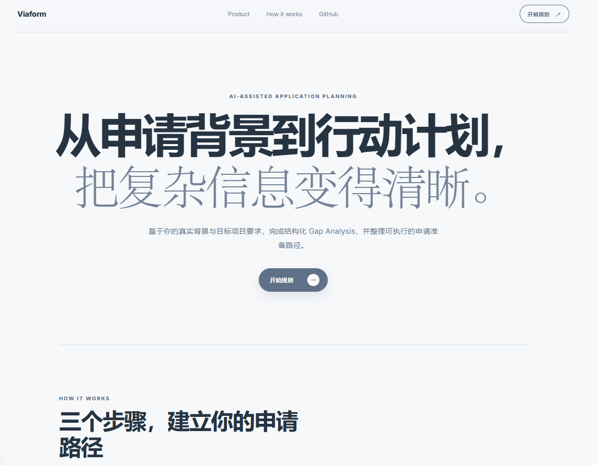
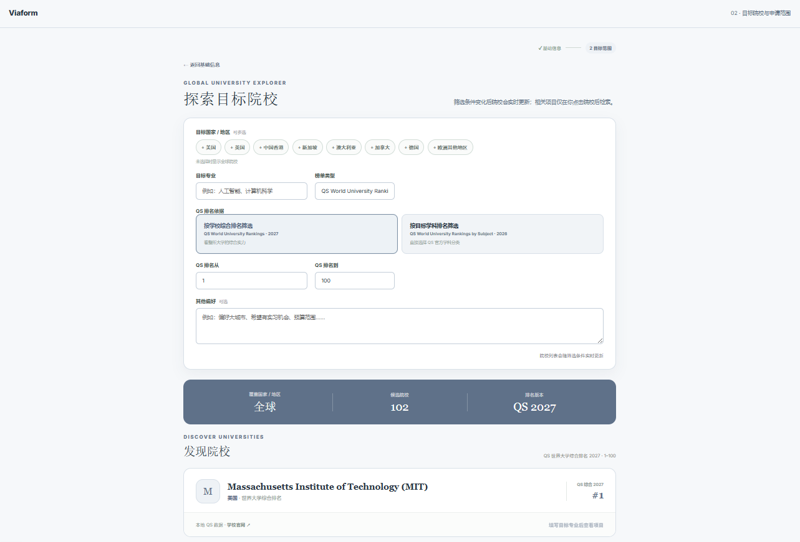
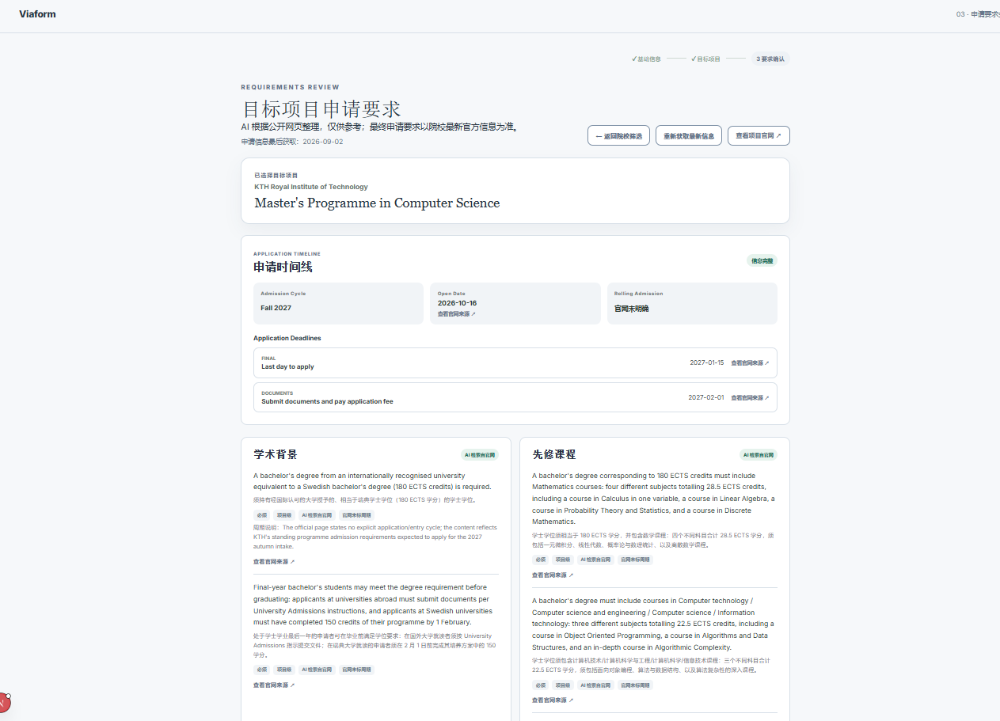
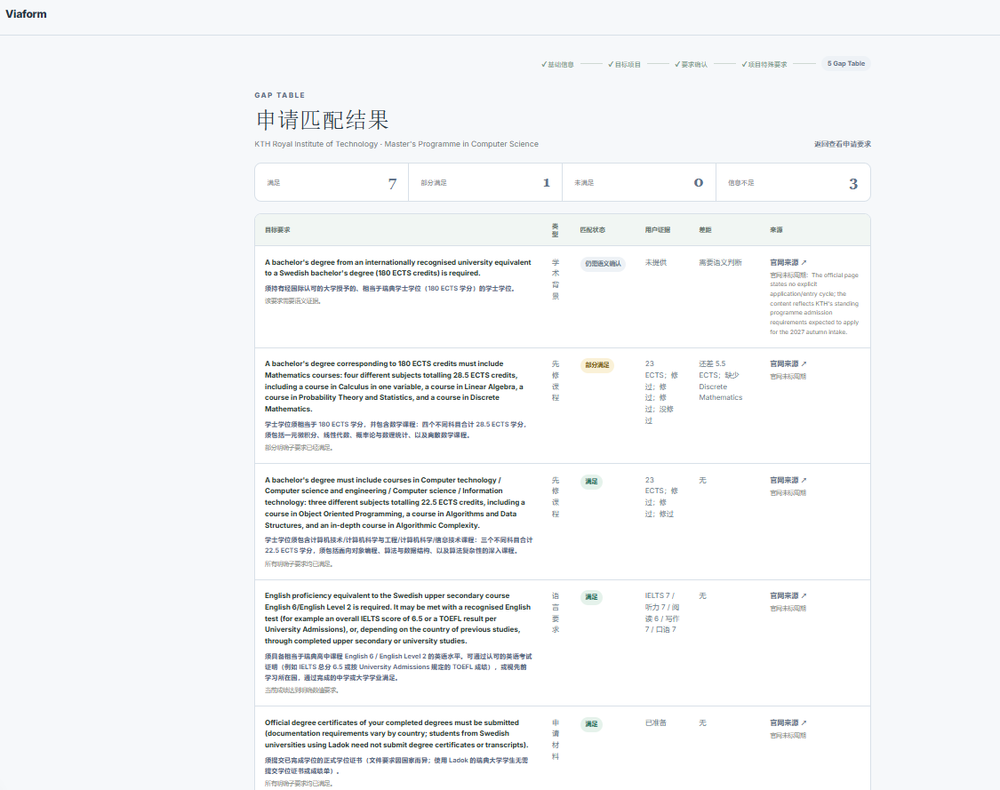
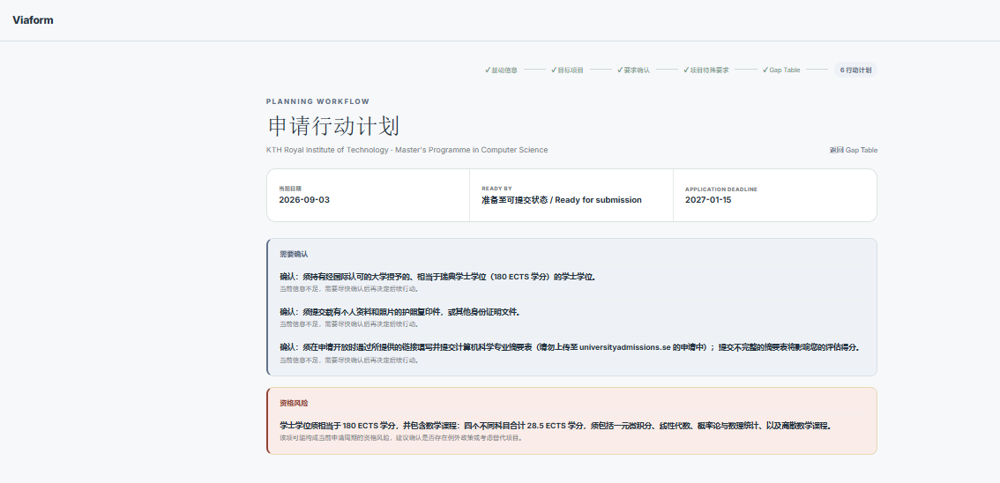
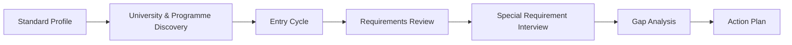

# UniversityApplyPlan（Viaform）

> AI-assisted study-abroad application planning prototype that turns a student's background and target programme requirements into a structured gap analysis and actionable plan.

这是一个面向中国留学生的留学申请规划 MVP。它将用户背景、院校与项目发现、申请要求、差距判断和行动计划组织成一条结构化流程，而不是一次性的通用 LLM 问答。

## 产品演示

Viaform 将用户的申请背景、目标项目要求和申请时间线组织成一条结构化流程，从项目定位一直到 Gap Analysis 和行动计划。



### 1. 探索目标院校与项目



根据目标国家/地区、专业方向和排名偏好筛选院校，并进一步定位相关硕士项目。

### 2. 核对官方要求与申请时间线



获取目标项目的 programme-level 官方申请要求，并整理对应申请周期的开放时间和关键截止日期。

### 3. 识别申请差距



将用户背景与目标项目要求逐项对比，区分满足、部分满足、未满足和信息不足。

### 4. 生成申请行动计划



根据识别出的 Gap 和申请时间线生成后续行动，同时区分可执行任务、资格风险和仍需确认的信息。

## 项目解决什么问题

目标项目官网信息分散且会随申请周期变化。申请人往往难以判断自己的背景是否满足要求、还缺哪些材料或资格条件，以及应该优先准备什么。本项目将这些判断组织为可追踪的结构化工作流。

## 主要功能

- **Standard User Profile**：结构化收集学历、成绩、语言、标化考试和申请材料，并在本地保存。
- **QS University / Programme Discovery**：基于项目本地 QS 综合排名或学科排名数据筛选院校，并发现相关硕士项目。
- **Entry Cycle Selection**：在确认目标项目后选择目标入学年份和学期。
- **Requirements Retrieval**：从公开网页检索并整理目标项目的申请要求及来源。
- **Requirements Review**：按类别查看要求、来源和目标申请周期信息，并允许用户补充缺失内容。
- **Special Requirement Interview**：只补充第一轮背景未覆盖的项目特有客观信息。
- **Gap Analysis**：对比用户背景和申请要求，输出满足、部分满足、未满足或信息不足。
- **Application Timeline**：获取对应申请周期的开放时间与 Deadline；未找到时不补造日期。
- **Action Plan**：根据识别出的 Gap 和申请时间生成行动优先级与目标日期。

## 使用流程



Requirements 和 Timeline 会在目标项目及申请周期确认后获取。若没有额外的项目特有信息需要确认，流程会直接进入 Gap Analysis。

## Quick Start

需要 Git、Python 3.8+、Node.js 20.9+、npm 和 DeepSeek API Key。以下命令适用于 Windows PowerShell。

### 安装与启动

```powershell
git clone https://github.com/Adrian219-gif/UniversityApplyPlan.git
cd UniversityApplyPlan
cd backend
python -m venv .venv
.\.venv\Scripts\Activate.ps1
python -m pip install -r requirements.txt
Copy-Item .env.example .env
```

在 `backend/.env` 中填写：

```dotenv
DEEPSEEK_API_KEY=your_deepseek_api_key
```

然后安装 Frontend 并从项目根目录启动：

```powershell
cd ..\frontend
npm install
cd ..
python dev.py
```

`backend/.venv` 是用户本地创建且被 Git ignore 的虚拟环境。`backend/.env` 同样不会被跟踪；API Key 只由 Backend 读取，不会发送给 Frontend，DeepSeek API 用量费用由 Key 持有者承担。

`dev.py` 会使用该虚拟环境并同时启动：

- Frontend: [http://localhost:3000](http://localhost:3000)
- Backend: [http://127.0.0.1:8000](http://127.0.0.1:8000)
- API Docs: [http://127.0.0.1:8000/docs](http://127.0.0.1:8000/docs)

按 `Ctrl+C` 可停止两个服务。Frontend 默认连接 `http://localhost:8000`；Backend 地址变化时，可在 `frontend/.env` 中设置 `NEXT_PUBLIC_API_BASE_URL`。

## Tech Stack

| Area | Stack |
| --- | --- |
| Frontend | Next.js, React, TypeScript |
| Backend | FastAPI, Python, Pydantic |
| AI | DeepSeek, Live Web Search |
| Data | SQLite |

AI is used for search and semantic tasks, while deterministic code handles stable workflow and business rules.

## Project Structure

```text
frontend/      Next.js 产品界面
backend/       FastAPI、AI workflow、本地数据与测试
docs/evals/    Eval dataset、历史报告与 regression records
dev.py         Frontend + Backend 本地启动入口
```

## Evaluation & Documentation

项目包含 targeted tests、regression tests 和针对动态招生事实的人工审核记录：

- [MVP Eval Dataset](docs/evals/mvp_eval_dataset.md)
- [MVP Baseline Eval Report](docs/evals/mvp_eval_report.md)
- [Manual Review Results](docs/evals/mvp_manual_review_results.md)
- [Regression Cases](docs/evals/regression_cases.md)

历史 Eval 报告用于记录当时的结果和修复来源，不代表当前代码的最新全量评测结论。

## Known Limitations

- 实时官网检索可能带来较明显等待时间，复杂项目尤其如此。
- Web retrieval 存在一定随机性，不同运行之间可能出现轻微结果差异。
- AI 整理结果不等于独立事实验证；正式申请前应以目标申请周期的学校官网为准。
- 当前 Action Plan 主要处理 required Gap，不做持续动态更新，optional / preferred 要求暂不进入主计划。
- 当前支持浏览器 `localStorage` Profile persistence 和 Backend retrieval cache，但没有服务端用户账号、认证 Profile 或跨设备同步。
